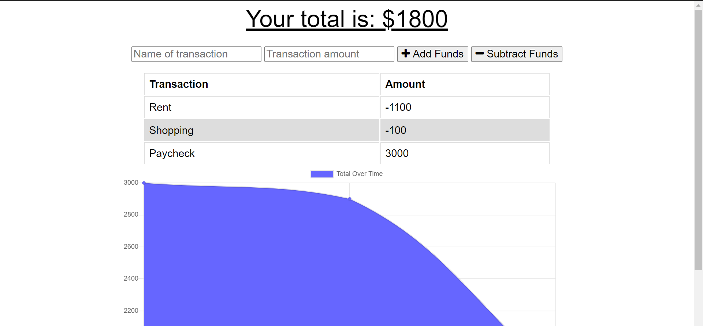

# Budget Tracker Starter Code

## User Story
AS AN avid traveler
I WANT to be able to track my withdrawals and deposits with or without a data/internet connection
SO THAT my account balance is accurate when I am traveling 

## Description
This is a very useful app for someone who wants to keep track of their finances.  This essentially works just like the old method of balancing a checkbook.  The user can enter a transaction with a title like "paycheck" or "shopping" and then enter the amount of funds that were added or subtracted.  The chart is updated with numbers and a moving graphic so the user can have a visualization of their account.  This functionality is possible because of the index.js file in the js folder.

## Screenshot

## Built With
* React
* Express
* Javascript
* MongoDB
* CSS
* HTML

## Live Link
https://powerful-crag-39646.herokuapp.com/

## Contributions
Melanie Gilman https://github.com/melaniegilman
